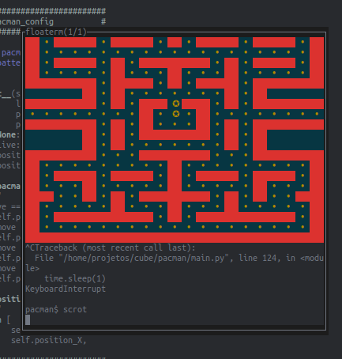

# Project-Pacman
"Recrie o clássico Pac-Man em Python. Controle o Pac-Man por um labirinto enquanto come pontos e evita fantasmas. Implemente inteligência artificial para os inimigos e desafie suas habilidades de programação."

